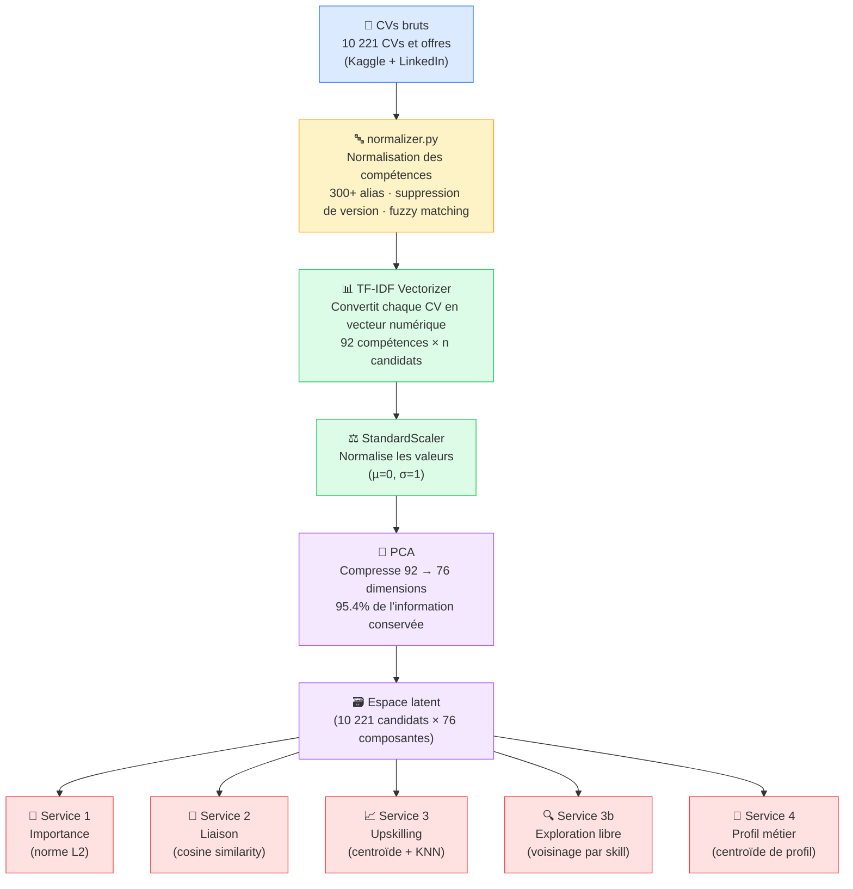
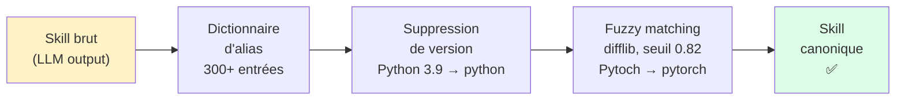
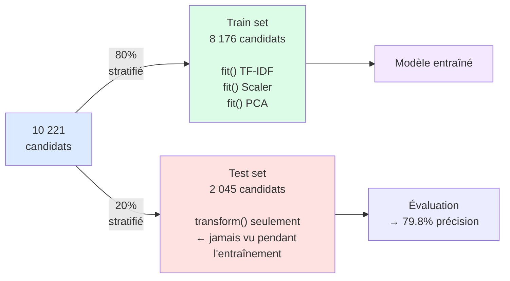
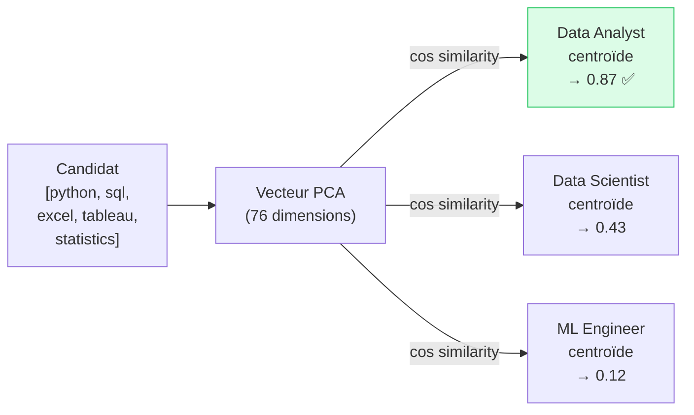

# 🧠 Modèle d'Intelligence des Compétences — ACP (PCA)

> Modèle de recommandation de compétences basé sur l'Analyse en Composantes Principales (PCA).
> Entraîné sur **10 221 CVs et offres d'emploi réels** (Kaggle + LinkedIn 2024).

[]()
[]()
[]()
[]()

---

## 📌 Que fait ce modèle ?

Il prend une **liste de compétences** en entrée et fournit 5 analyses :

| Service | Question répondue |
|---------|------------------|
| **Importance** | Quels sont mes skills les plus valorisés sur le marché ? |
| **Liaison** | Ces deux compétences vont-elles souvent ensemble ? |
| **Upskilling** | Quoi apprendre pour progresser vers un profil cible ? |
| **Exploration libre** | Quoi découvrir de nouveau sans viser un titre précis ? |
| **Profil métier** | Quel métier correspond le mieux à mon profil ? |

---

## 🗺️ Pipeline complet



---

## 📂 Les données d'entraînement

### D'où viennent les données ?

Trois sources réelles sont fusionnées par `merge_real_datasets.py` :

```
data/
├── real_cvs.jsonl                    ← Kaggle "Curriculum Vitae" dataset
│                                        ~4 200 CVs avec compétences extraites
│
└── raw/
    ├── AI_Resume_Screening.csv       ← Dataset de screening RH
    │                                    ~210 lignes valides
    └── job_skills.csv                ← Offres d'emploi LinkedIn 2024
                                         ~5 800 offres avec skills requis
```

> ⚠️ **Les données synthétiques sont intentionnellement exclues.**
> Entraîner sur des données parfaitement propres donnerait une précision de 100%,
> ce qui ne reflète pas la réalité. Avec des données réelles : **79.8%** — honnête et réaliste.

### Répartition des profils

```
data_scientist    ████████████████████████████████████  51.0%
data_engineer     ███████████████                        20.9%
data_analyst      █████████████                          17.6%
ml_engineer       ████                                    5.5%
mlops_engineer    ██                                      2.8%
ai_researcher     █                                       1.5%
nlp_engineer      ▏                                       0.5%
cv_engineer       ▏                                       0.1%
```

---

## ⚙️ Les technologies utilisées — expliquées simplement

### 1. 🔤 Normalisation des compétences (`normalizer.py`)

**Le problème :** Quand un LLM analyse un CV, il peut écrire le même skill de 10 façons différentes.

```
"React.js"    "ReactJS"    "REACTJS"    "react"      → tous veulent dire  react
"Python 3.9"  "Python3"    "python"                  → tous veulent dire  python
"Sci-kit learn"  "sklearn"  "scikit learn"            → tous veulent dire  scikit-learn
"Pytoch"  ← faute de frappe !                         → fuzzy match        pytorch
"good communication skills"                           → SUPPRIMÉ (soft skill)
```

**La solution — 3 couches :**



**Utilisation dans le code :**
```python
from normalizer import normalize_skill_list

skills_bruts = ["Python 3.9", "ReactJS", "k8s", "sklearn", "Pytoch", "teamwork"]
skills_propres = normalize_skill_list(skills_bruts, fuzzy=True)
# → ["python", "react", "kubernetes", "scikit-learn", "pytorch"]
# "teamwork" est supprimé car non technique
```

---

### 2. 📊 TF-IDF — Pondération intelligente des compétences

**Le problème :** Si on met juste 1 ou 0 pour "a ce skill / n'a pas ce skill",
alors `python` aurait le même poids que `kubeflow`, même si **tout le monde** a Python.

**L'analogie :** Imagine une bibliothèque de livres. Si un mot apparaît dans tous les livres
(comme "le", "de"), il n'est pas très informatif. Mais si un mot n'apparaît que dans 3 livres
(comme "kubernetes"), c'est un signal fort sur le sujet de ces livres.

C'est exactement ce que fait TF-IDF :

```
TF  (Term Frequency)          = ce skill apparaît dans ce CV         → le boost
IDF (Inverse Document Freq.)  = ce skill apparaît dans TOUS les CVs  → la pénalité

Poids final = TF × IDF
```

**Concrètement :**

| Compétence | Présence dans le dataset | Poids IDF |
|-----------|--------------------------|-----------|
| `python` | 95% des CVs | **faible** — tout le monde l'a |
| `sql` | 70% des CVs | moyen |
| `kubeflow` | 3% des CVs | **élevé** — rare, donc discriminant |
| `julia` | 1% des CVs | **très élevé** — très spécialisé |

**Paramètres choisis :**
```python
TfidfVectorizer(
    sublinear_tf=True,   # log(1 + tf) au lieu de tf brut → réduit l'impact des répétitions
    min_df=5,            # ignore les skills vus dans moins de 5 CVs (bruit)
    norm="l2",           # normalisation unitaire de chaque vecteur
)
```

---

### 3. ⚖️ StandardScaler — Mise à l'échelle des données

**Pourquoi ?** Avant de faire la PCA, toutes les colonnes doivent être à la même échelle.
Sinon, une colonne avec des valeurs entre 0 et 1000 "dominerait" une colonne entre 0 et 1.

**L'analogie :** Imagine que tu compares la taille (en cm) et le poids (en kg) de personnes.
La taille varie de 150 à 200 (+50), le poids de 50 à 100 (+50 aussi), mais en cm la variation
"semble" plus grande. Le StandardScaler ramène tout à µ=0, σ=1.

> ⚠️ **Règle d'or :** Le scaler est **entraîné uniquement sur les données d'entraînement**,
> puis appliqué (.transform) sur les données de test. On ne "regarde" jamais les données
> de test avant l'évaluation finale.

---

### 4. 🧠 PCA — L'Analyse en Composantes Principales

C'est la pièce centrale du modèle. Voici comment la comprendre simplement.

**L'analogie de la photo :**

> Imagine que tu veux prendre en photo un objet 3D (une bouteille).
> Tu ne peux pas capturer toutes les dimensions à la fois en 2D,
> mais tu peux choisir **l'angle qui capture le plus d'information**.
> La PCA fait exactement ça : elle trouve les "meilleurs angles" pour compresser les données.

**Ce que fait la PCA concrètement :**

```
AVANT PCA :
Chaque candidat = vecteur de 92 chiffres (un par skill)
[0.8, 0.0, 0.3, 0.0, 0.9, 0.0, 0.0, 0.4, ...]
 python  r   sql  go  pandas  ...

APRÈS PCA :
Chaque candidat = vecteur de 76 chiffres (composantes abstraites)
[0.42, -0.18, 0.91, 0.03, ...]
  PC1    PC2    PC3   PC4  ...

Compression : 92 → 76 dimensions, en perdant seulement 4.6% de l'information.
```

**Que représentent les composantes ?**

La PCA découvre automatiquement des "groupes" de skills qui vont ensemble :

```
PC1 ≈ "Profil ML / Python"     → tensorflow, numpy, pandas, pytorch
PC2 ≈ "Profil Full Stack"      → javascript, angular, java, spark
PC3 ≈ "Profil Data Analyst/BI" → sql, power_bi, tableau, r, excel
PC4 ≈ "Profil NLP"             → sentence_transformers, spacy, bert
```

**Visualisation — l'espace latent :**

```
                  PC2 (Full Stack / Java)
                       ↑
         ● ● ●         │          ○ ○ ○
        ●  ML  ●       │         ○ Full ○
         ● ● ●         │          ○ Stack
                       │
─── ── ─ ── ─ ─ ── ───┼─── ── ─ ── ─ ─ ── ───▶  PC1 (ML / Python)
                       │
         ▲ ▲ ▲         │          ■ ■ ■
        ▲  BI  ▲       │         ■  DE  ■
         ▲ ▲ ▲         │          ■ ■ ■
                       │
```

Chaque point = un candidat. Les candidats avec des skills similaires sont proches dans l'espace.

---

### 5. ✂️ Séparation Train / Test (80% / 20%)

**Pourquoi séparer ?** Pour évaluer honnêtement le modèle sur des données **qu'il n'a jamais vues**.



**Stratification :** La séparation est faite de façon à garder la même proportion de chaque
profil métier dans le train et le test. Sans ça, les profils rares pourraient disparaître du test set.

---

### 6. 🏆 KNN — K-Nearest Neighbors (évaluation)

Le KNN est utilisé pour **évaluer la qualité de la PCA**, pas comme service final.

**L'analogie :** Pour savoir si un candidat est Data Scientist ou Data Engineer,
on regarde ses **5 voisins les plus proches** dans l'espace latent PCA.
Si 4 d'entre eux sont Data Scientist, on prédit Data Scientist.

```
         Candidat inconnu ★
              │
    ┌─────────┼─────────┐
    │         │         │
   DS        DS        DE
(voisin 1) (voisin 2) (voisin 3)
              │         │
             DS        DS
         (voisin 4) (voisin 5)

Résultat : 4 DS sur 5 → prédit Data Scientist ✅
```

**Distance mesurée :** Similarité cosinus (pas la distance euclidienne).
La similarité cosinus mesure l'**angle** entre deux vecteurs, pas leur distance absolue.
Ça fonctionne mieux pour des vecteurs de haute dimension.

---

## 🔧 Les 5 services d'inférence

### Service 1 — Importance des compétences

**Principe :** La norme L2 du vecteur latent d'un skill mesure son "importance".

```
Importance(skill) = √(v₁² + v₂² + ... + v₇₆²)
```

**Interprétation :** Un skill avec une grande norme L2 contribue à beaucoup de composantes PCA
→ il est très **discriminant** entre les profils → il est structurant pour le marché.

```python
result = analyzer.skill_importance(skills=["python", "spark", "tableau", "julia"])
# julia  → 0.999  (très rare, très spécialisé → très discriminant)
# spark  → 0.972  (propre aux Data Engineers)
# tableau→ 0.979  (propre aux Data Analysts)
# python → 0.744  (tout le monde l'a → moins discriminant)
```

---

### Service 2 — Liaison entre compétences

**Principe :** Similarité cosinus entre les vecteurs latents de deux skills.

```
Liaison(A, B) = cos(θ) = (vA · vB) / (|vA| × |vB|)
```

| Valeur | Signification |
|--------|--------------|
| Proche de **+1** | Toujours utilisés ensemble (ex: docker ↔ kubernetes) |
| Proche de **0** | Indépendants, profils différents |
| Proche de **-1** | Rarement ensemble (profils opposés) |

```python
analyzer.skill_liaison("docker", "kubernetes")    # → 0.89  (très liés)
analyzer.skill_liaison("pytorch", "tableau")      # → 0.02  (profils opposés)
```

---

### Service 3 — Upskilling (avec cible de carrière)

**Principe :** Centroïde des vecteurs de skills du candidat → KNN dans l'espace des skills.

```
1. Pour chaque skill connu : récupérer son vecteur latent
2. Calculer la moyenne → "position du candidat" dans l'espace
3. Trouver les K skills les plus proches non encore maîtrisés
```

**Analogie :** Le candidat est un point dans l'espace. On cherche les skills
"physiquement les plus proches" de ce point.

```python
result = analyzer.upskilling(["python", "pandas", "sql"], top_n=5)
# → scikit-learn, numpy, matplotlib, statistics, seaborn
```

---

### Service 3b — Exploration libre (sans biais de carrière)

**Différence avec l'Upskilling :**

```
upskilling()      → centroïde global → une seule direction → biaisé vers profil dominant
explore_skills()  → voisinage par skill → toutes directions → pas de biais de titre
```

**Principe :**
1. Pour **chaque** skill connu, trouver ses K voisins indépendamment
2. Pool tous les voisins trouvés
3. Score = similarité_moyenne × (1 + 0.4 × (nb_sources − 1))

Le **nb_sources** est la clé : un skill "pont" proche de 4 de tes skills à la fois
est plus utile qu'un skill proche d'un seul.

```python
result = analyzer.explore_skills(["python", "react", "sql", "docker"])
# → nodejs (n_sources=4, via python+react+sql+docker) ← skill pont !
# → kubernetes (n_sources=1, via docker)
# → javascript (n_sources=3, via react+sql+docker)
```

---

### Service 4 — Recommandation de profil métier

**Principe :** Pendant l'entraînement, on calcule le **centroïde** de chaque profil
(vecteur moyen de tous les candidats du profil). On mesure ensuite la similarité cosinus
entre le candidat et chaque centroïde.



```python
result = analyzer.profile_recommendation(
    ["python", "sql", "excel", "tableau", "statistics"]
)
# → 1. Data Analyst  (0.87)  ✅
# → 2. Data Scientist (0.43)
# → 3. ML Engineer   (0.12)
```

---

## 📈 Résultats du modèle

### Métriques expliquées

| Métrique | Valeur | Ce que ça veut dire |
|----------|--------|---------------------|
| **Précision test** | 79.8% | Sur 100 candidats inconnus, 80 sont classés dans le bon métier |
| **CV accuracy (5-fold)** | 79.7% ± 1.1% | Même résultat sur 5 découpages différents → pas de chance |
| **R² reconstruction** | 94.6% | On peut reconstruire le vecteur original à 94.6% depuis les 76 composantes |
| **Variance expliquée** | 95.4% | Les 76 composantes capturent 95.4% de l'information originale |
| **Silhouette (2D)** | −0.19 | Les profils se chevauchent en 2D — c'est **normal** et réaliste |

### Pourquoi 79.8% et pas 100% ?

```
                        CE QUI CONFOND LE MODÈLE

        Data Scientist  ←──────────────→  Data Engineer
        ──────────────                    ─────────────
        python, pandas                    python, sql
        sql, statistics          ↑        spark, docker
        scikit-learn         CHEVAUCHEMENT  airflow
                            INTENTIONNEL
                            (réel sur le marché)
```

Un Data Scientist senior peut avoir les skills d'un Data Engineer, et vice versa.
La confusion du modèle **reflète la réalité** du marché.

### Matrice de confusion (résumée)

```
                    Prédit →
                 DS    DE    DA    MLE  Other
Réel  DS    [  849   74    87    22    10  ]   82% bien classés
      DE    [   48  330    27     3     5  ]   80% bien classés
      DA    [   58   14   218     0     0  ]   74% bien classés
      MLE   [   16   10     2    80     2  ]   68% bien classés
```

---

## 🚀 Installation & Utilisation

### Pré-requis

```bash
pip install scikit-learn numpy pandas joblib
```

### Utilisation rapide

```python
from inference import SkillAnalyzer

# Charger le modèle (une seule fois au démarrage)
analyzer = SkillAnalyzer(models_dir="models")

# Analyser un profil
skills = ["python", "sql", "pandas", "scikit-learn", "docker"]

# Les 5 services
print(analyzer.profile_recommendation(skills))  # Quel métier suis-je ?
print(analyzer.skill_importance(skills=skills))  # Quels skills sont les plus valorisés ?
print(analyzer.skill_liaison("docker", "kubernetes"))  # Ces skills vont-ils ensemble ?
print(analyzer.upskilling(skills, top_n=5))  # Quoi apprendre pour progresser ?
print(analyzer.explore_skills(skills, top_n=8))  # Quoi découvrir sans objectif précis ?
```

### Re-entraîner le modèle

```bash
# 1. Fusionner les données (si nouvelles sources)
python merge_real_datasets.py --out data/real_merged.csv

# 2. Re-entraîner
python train_pipeline.py --data data/real_merged.csv

# 3. Vérifier manuellement
python test_manual_skills.py
```

---

## 📁 Structure des fichiers

```
Modele-ACP/
│
├── 📄 merge_real_datasets.py   ← Fusionne les 3 sources de données réelles
├── 📄 train_pipeline.py        ← Pipeline complet : TF-IDF → PCA → évaluation
├── 📄 inference.py             ← Les 5 services (à importer dans l'app web)
├── 📄 normalizer.py            ← Normalisation des compétences (300+ alias)
├── 📄 test_manual_skills.py    ← Tests manuels du modèle
│
├── 📓 skill_model_notebook.ipynb ← Explication complète avec visualisations
│
├── 📂 data/
│   ├── real_merged.csv         ← Dataset final (10 221 lignes)
│   └── raw/                   ← Sources brutes
│
└── 📂 models/                 ← Artefacts du modèle entraîné
    ├── pca_model.pkl           ← Modèle PCA (76 composantes)
    ├── tfidf_vectorizer.pkl    ← Vectoriseur TF-IDF (92 skills)
    ├── scaler.pkl              ← StandardScaler
    ├── skill_names.pkl         ← Liste ordonnée des 92 skills
    ├── skills_vectors.pkl      ← Coordonnées latentes des skills (92 × 76)
    ├── cv_vectors.pkl          ← Coordonnées latentes des candidats
    ├── profile_centroids.pkl   ← Centroïdes des 8 profils métier
    ├── meta.json               ← Statistiques du modèle
    └── eval_report.json        ← Rapport d'évaluation complet
```

---

## 🎓 Glossaire des termes techniques

| Terme | Explication simple |
|-------|--------------------|
| **PCA / ACP** | Compression intelligente des données qui garde l'essentiel |
| **Espace latent** | L'espace mathématique "caché" où vivent les représentations compressées |
| **Vecteur** | Une liste de chiffres qui représente un objet (un CV, un skill) |
| **Centroïde** | Le point "moyen" d'un groupe — la moyenne de tous les vecteurs du groupe |
| **Similarité cosinus** | Mesure l'angle entre deux vecteurs (0 = perpendiculaires, 1 = parallèles) |
| **TF-IDF** | Pondération qui valorise les mots rares et pénalise les mots trop communs |
| **KNN** | Algorithme qui prédit en regardant les K voisins les plus proches |
| **Norme L2** | La "longueur" d'un vecteur = racine de la somme des carrés de ses composantes |
| **Overfitting** | Quand un modèle "mémorise" les données d'entraînement mais ne généralise pas |
| **Cross-validation** | Technique pour évaluer la robustesse du modèle sur plusieurs découpages |
| **Fuzzy matching** | Comparaison approximative de texte pour détecter les fautes de frappe |

---

*Projet de Fin d'Études (PFE) — Yassine Chtourou*
